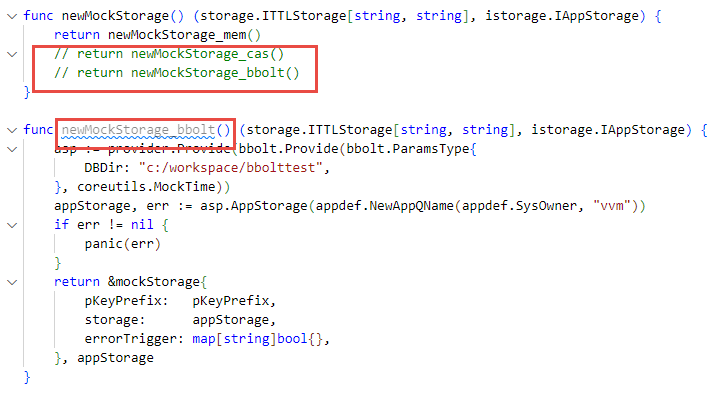
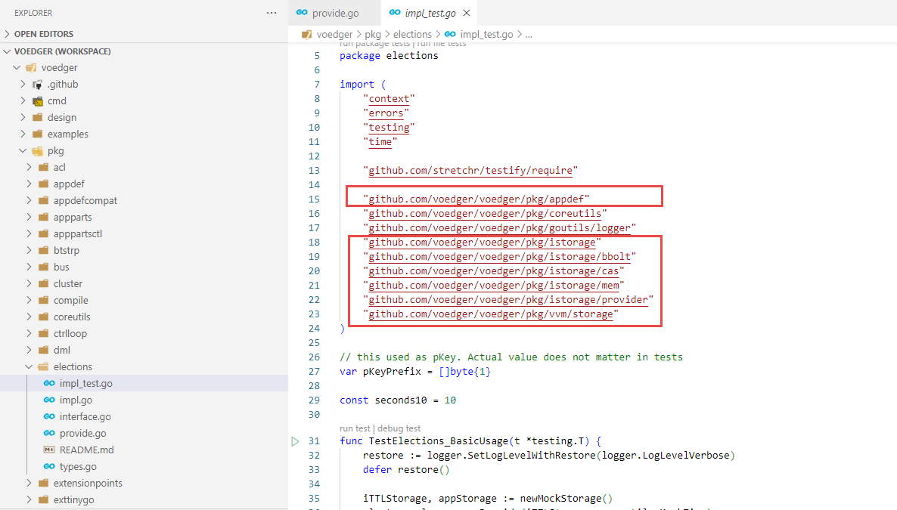

# Go Development Guidelines

This document outlines the development guidelines for Go-based projects at Voedger.

## Foundations and Key References

- [Effective Go](https://go.dev/doc/effective_go)
- [Go Proverbs](https://go-proverbs.github.io/)
  - Rob Pike's Go Proverbs Series:
    - [Part One](https://golangprojectstructure.com/rob-pike-go-proverbs/)
    - [Part Two](https://golangprojectstructure.com/rob-pike-go-proverbs-2/)
    - [Part Three)](https://golangprojectstructure.com/rob-pike-go-proverbs-3/)
- [google.github.io/styleguide/go/decisions.html](https://google.github.io/styleguide/go/decisions.html)
- [10 things you (probably) don't know about Go](https://go.dev/talks/2012/10things.slide)
- [Subtests in Go](https://go.dev/blog/subtests)
- [Go Type System Overview](https://go101.org/article/type-system-overview.html)

## Package Structure

- [Package Structure Guide](https://github.com/voedger/kb/issues/45)
- [requirements.md](writing-guidelines.md#requirementsmd-files)

## Concurrency Review Requirements

All implementations involving concurrency patterns (goroutines, sync package) must undergo both human and AI-assisted code review. See [example review](https://github.com/voedger/kb/issues/57).

## Testing Guidelines

### `testdata` Directory

The `testdata` directory name is reserved by the Go toolchain. Files in this directory are ignored during build and analysis, making it suitable for test fixtures, including Go source files.

### Black-box Testing

Implement tests in the `<package-name>_test` package to adhere to black-box testing principles.

### Testable Examples

Prioritize creating testable examples to demonstrate code usage:

- [Official Go Examples Guide](https://go.dev/blog/examples)
- [Example: binary package tests](https://cs.opensource.google/go/go/+/refs/tags/go1.20.5:src/encoding/binary/example_test.go)
- [Example: `binary.Write`](https://pkg.go.dev/encoding/binary#example-Write)
- [Example: `in10nmem` tests](https://github.com/voedger/voedger/blob/15ef848eecdc1950a6eba71732991012d509be18/pkg/in10nmem/example_test.go#L21)

## Code Quality

### Script Files

Use `.sh` or `.bash` files instead of `.cmd` files.

### Anti-patterns to Avoid

Key dynamic anti-patterns:

- Busy Waiting (Spin Waiting)
- Goroutine/Task/Thread Leaks
- Heap Escapes Without Reuse (critical in hot paths)

## Avoid commented-out and dead code

<kbd></kbd>

## Avoid tightly coupling between packages

Maintain loose coupling between packages, including test suites.

<kbd></kbd>

For dependency injection testing:

**In the interface package:**

- Declare the interface (`IElections`) and all possible injections (`ITTLStorage`).
- Create an interface test suite (e.g., `IElectionsTestSuite`).
- Create mock implementations for all possible injections.
- Create a reference implementation for the interface.
- Use `IElectionsTestSuite` to test the reference implementation.

**In packages that inject dependencies:**

- Use `IElectionsTestSuite` to test the implementation with specific injections.
