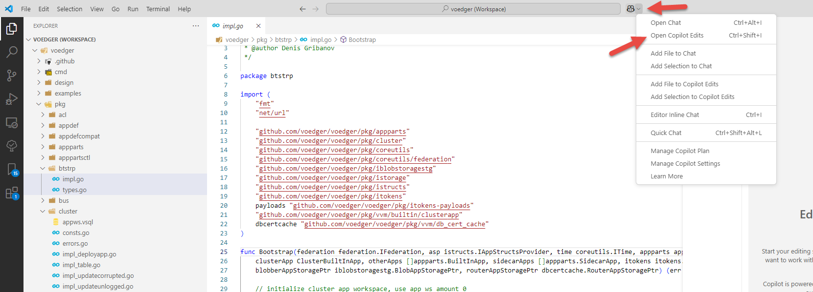
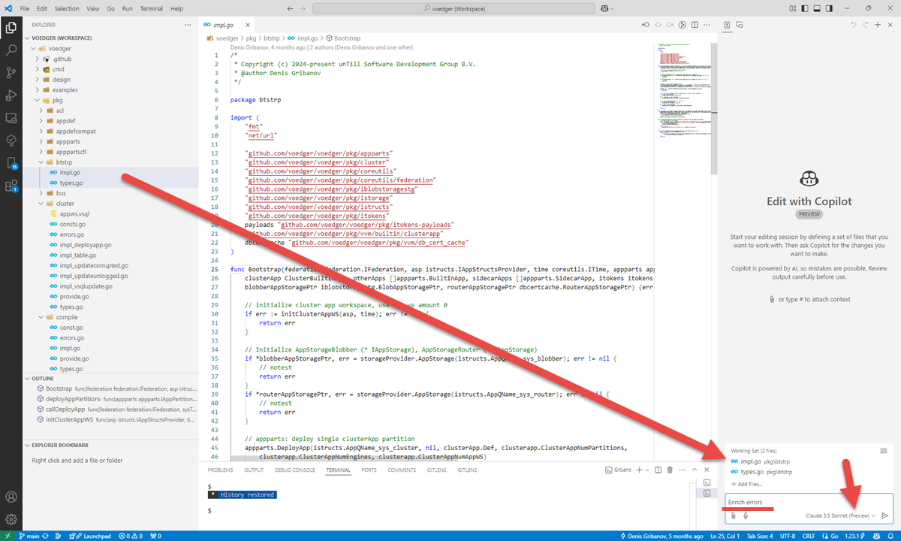

# Practical tips for Go-based development

## Copilot Edits

Open Copilot Edits:



Drag-and-drop the files to the `Working Set`, enter the command (`Enrich errors`) and choose the model:


Next:
- Accept
- ☝️Click `Done` in Working Set
- Enter the next command, e.g.
  - `Move all string literals to str.go`
  - Create snake.py and execute `Generate a snake game`

---
## F1: Test Previous, Debug Previous


---
## Find All References


---
## Emoji

- 📂apps
  - 📁app1
    - 📁image // unzipped app image
    - descriptor.json

⊞ Win + `.` 


---
## Ensure a type implements an interface

```go
// Let we have an interface...
type SomeInterface interface {
    Method()
}

// Let we have a type...
type Implementation struct{}

func (*Implementation) Method() { fmt.Println("Hello, World!") }

// We want to ensure that the type implements the interface...
var _ SomeInterface = (*Implementation)(nil) // ← this does the job
```

-  [Playground](https://go.dev/play/p/8cAxiaY8KEj)
-  Spotted in: [medium.com: Write Go like a senior engineer](https://levelup.gitconnected.com/write-go-like-a-senior-engineer-eee7f03a1883)

## Configuration

- [Configuration](https://github.com/voedger/kb/issues/51)