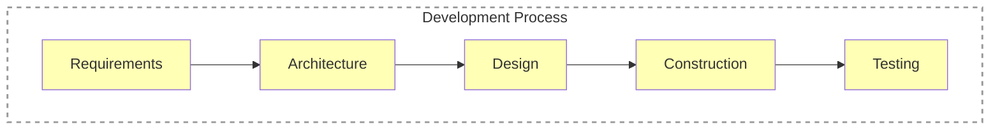
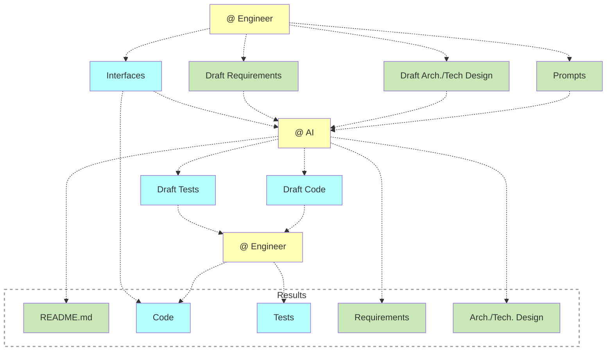

# Software Engineering & AI

**Software Engineering and Software Development Process**:

**Using AI in Software Development Process**:

**Requirements**:

- Concepts (text + static diagrams)
- Principles/Constraints (text)
- Functional design
  - Use Cases
  - Dynamic diagrams

**Architecture/Technical Design**:

- Concepts (text + static diagrams)
- Principles/Constraints (text)
- Components (static diagrams)
- Use Case technical design (dynamic diagrams)

**Static diagrams**:

- [ERD](https://mermaid.js.org/syntax/entityRelationshipDiagram.html). An examle: [workspaces/README.md](https://github.com/voedger/voedger-internals/blob/88ed0e6d2e6f218d2d146715ed5048e313cb9d75/server/workspaces/README.md)
- [Class diagram](https://mermaid.js.org/syntax/classDiagram.html). An example: [appdef](https://github.com/voedger/voedger/blob/1bab84681330e28922a80203dfd86df19f9a2454/pkg/appdef/README.md).
- [C4 model](https://github.com/voedger/voedger-docs/blob/main/concepts/notation.md). An example: [child-workspaces.md](https://github.com/voedger/voedger-internals/blob/88ed0e6d2e6f218d2d146715ed5048e313cb9d75/concepts/workspaces/child-workspaces.md#L64)

**Dynamic diagrams**:

- [Sequence diagram](https://mermaid.js.org/syntax/sequenceDiagram.html). An examle: [join-ws.md](https://github.com/voedger/voedger-internals/blob/88ed0e6d2e6f218d2d146715ed5048e313cb9d75/server/invites/join-ws.md)
- [DFD](https://mermaid.js.org/syntax/flowchart.html)

**Examples**:

- [Sequences](https://github.com/voedger/voedger-internals/blob/bf2720cf6b90aba68ca3876f8dd0fbea4e667b73/server/design/sequences.md#L45-L46)