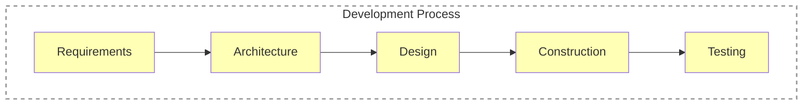
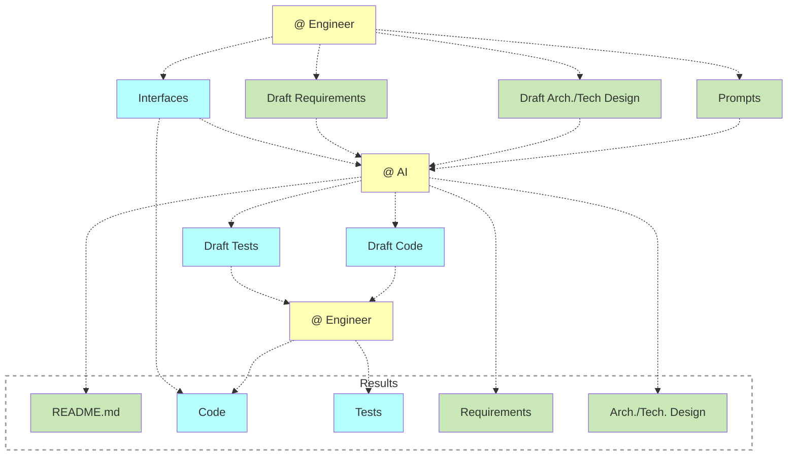

# Software Engineering

- **Software Engineering**: The application of a systematic, disciplined, quantifiable approach to the development, operation, and maintenance of software; that is, the application of engineering
to software (ISO/IEC/IEEE, “ISO/IEC/IEEE 24765:2017 Systems and Software Engineering — Vocabulary,” 2nd ed. 2017.)
- **disciplined**: (ˈdɪsɪplɪnd) showing a controlled form of behavior or way of working.
- **quantifiable**: (kwɒntɪˈfaɪəbl) able to be expressed or measured as a quantity.
- **Systematic approach**: An approach that follows the system of predefined principles and procedures
- **Why**: To achieve consistent (stable) results


## Knowledge Areas

According to  [SWEBOK, Guide to the Software Engineering Body of Knowledge v4.0](https://ieeecs-media.computer.org/media/education/swebok/swebok-v4.pdf):

- Software Requirements
- Software Architecture
- Software Design
- Software Construction
- Software Testing
- Software Engineering Operations
- Software Maintenance
- Software Configuration Management
- Software Engineering Management
- Software Engineering Process
- Software Engineering Models and Methods
- Software Quality
- Software Security
- Software Engineering Professional Practice
- Software Engineering Economics
- Computing Foundations
- Mathematical Foundations
- Engineering Foundations

SWEBOK:
- The Guide to the Software Engineering Body of Knowledge (SWEBOK Guide), published by the IEEE Computer Society (IEEE CS), represents the current state of generally accepted, consensus-based knowledge emanating from the interplay between software engineering theory and practice. Its objectives include the provision of guidance for learners, researchers, and practitioners to identify and share a common understanding of “generally accepted knowledge” in software engineering, defining the boundary between software engineering and related disciplines, and providing a foundation for certifications and educational curricula.
- [An Overview of the SWEBOK Guide](https://sebokwiki.org/wiki/An_Overview_of_the_SWEBOK_Guide)

## Architecture

> **Architecture** (of a (sub)system). Fundamental concepts or properties of a system in its environment embodied in its elements, relationships, and in the principles of its design and evolution.
> Key ideas in that definition are the following
> - **(1)** Architecture is about what is *fundamental* to a software system; not every element, interconnection, or interface is considered fundamental.
> - **(2)** Architecture considers a system *in its environment*. Much like building architecture, software architecture is outward-looking; it considers a system’s context beyond its boundaries including the people, organizations, software, hardware and other devices with which the system must interact.
> 
> *SWEEBOK*

> Architecture is the aspect of a system's design that allows to understand the system's guiding principles, major components, interactions and behavior.
> 
> *maxim-ge*

## Design

> **Software Design** is a practical process of transforming a problem statement into a solution statement.
>
> *SWEEBOK*

> **Software design** is the transformation of customer and other requirements, needs, and concerns into implementable design specifications.
>
> *SWEEBOK*

## Software Engineering & AI

**Software Engineering and Software Development Process**:


**Using AI in Software Development Process**:


**Draft Requirements**:
- Concepts (text + static diagrams)
- Functional design
    - Use Cases
    - Dynamic diagrams

**Draft Architecture/Technical Design**:
- Components (static diagrams)
- Use Case design (dynamic diagrams)

**Static diagrams**:
- [ERD](https://mermaid.js.org/syntax/entityRelationshipDiagram.html)
- [Class diagram](https://mermaid.js.org/syntax/classDiagram.html). An example: [appdef](https://github.com/voedger/voedger/blob/1bab84681330e28922a80203dfd86df19f9a2454/pkg/appdef/README.md).
- [C4 model](https://github.com/voedger/voedger-docs/blob/main/concepts/notation.md)

**Dynamic diagrams**:
- [Sequence diagram](https://mermaid.js.org/syntax/sequenceDiagram.html)
- [DFD](https://mermaid.js.org/syntax/flowchart.html)

**Examples**:
- [Sequences](https://github.com/voedger/voedger-internals/blob/bf2720cf6b90aba68ca3876f8dd0fbea4e667b73/server/design/sequences.md#L45-L46)

## Dynamic anti-patterns

**Dynamic anti-patterns**: Code patterns that lead to the degradation of performance, reliability, or maintainability.

Cause: Dynamic anti-patterns often stem from poorly designed concurrency control, resource handling, or error-handling mechanisms. Even if the initial architecture seems correct, **runtime behavior** can reveal significant inefficiencies (like busy waiting) or hidden faults. Addressing them involves:

- Using **proper synchronization** techniques (locks, semaphores, wait/notify, etc.)
- Avoiding **polling** where event-driven approaches are possible
- Employing **resource pooling**, **backpressure**, and **circuit breakers** to keep the system healthy under variable load
- Ensuring **clean-up** and **monitoring** of all resources to prevent leaks or meltdown conditions

---

### Busy Waiting (Spin Waiting)
- **What it is:** A thread (or process) constantly checks for a condition in a loop.
- **Why it’s bad:** Consumes CPU cycles unnecessarily, leading to higher resource utilization and possible starvation of other threads.
- **Better approach:** Use proper synchronization constructs like semaphores, mutexes, events, or condition variables that allow the waiting thread to sleep until notified.

---

### Goroutine/Task/Thread Leak

- **What it is:**  
  Spawning goroutines but never providing a mechanism to ensure they are properly signaled to stop and waited on. Even if you only spin up *one* goroutine perprocess, it still counts as a leak if it never completes or is never formally shut down.
  
- **Why it’s bad:**  
  - Goroutines remain running indefinitely and can gradually consume memory or CPU resources.  
  - Cleanup or graceful termination becomes complex, since no one is tracking when (or if) the goroutine should stop.
  - Errors or partial work may go unnoticed if the goroutine outlives the rest of the application or terminates abruptly.

- **Better approach:**  
  - **Context cancellation** (`context.Context`): Pass a context to your goroutine so it can exit cleanly when the context is canceled.  
  - **WaitGroups or other sync mechanisms**: Use a `sync.WaitGroup` to ensure the main function doesn’t exit before the goroutine is done, or to wait for graceful shutdown.  
  - **Lifecycle management / cleanup functions**: Libraries like [Google Wire](https://github.com/google/wire) allow you to define “cleanup” functions. After wiring up your dependencies, Wire can invoke these cleanup callbacks as part of a structured program shutdown. Use them to cancel running goroutines or release resources consistently.  
  - **Channel-based coordination**: Send signals through channels to instruct goroutines to finish their work and exit gracefully.

---

### Heap Escape Without Reuse

- **What it is:**  
  Allowing a pointer or slice to escape to the heap during allocation, especially when the object is never reused, resulting in unnecessary memory allocations. This often occurs when functions allocate memory for return values that could have been allocated on the stack or reused across calls.

- **Why it’s bad:**  
  - Increased pressure on the garbage collector, as heap-allocated objects require more overhead to manage.  
  - Decreased performance due to higher memory allocation costs and potential cache inefficiency.  
  - Missed optimization opportunities: Objects that could stay on the stack are cheaper and faster to allocate and deallocate.

- **Example:**  
  ```go
  func (bp *borrowedPartition) IsOperationAllowed(ws appdef.IWorkspace, op appdef.OperationKind, res appdef.QName, fld []appdef.FieldName, roles []appdef.QName) (bool, []appdef.FieldName, error) {
      // `fld` is allocated but not reused, causing a heap escape
      fld = make([]appdef.FieldName, 0)
      // Logic populates `fld`...
      return true, fld, nil
  }
  ```
  Here, the slice `fld` is allocated but is not reused or managed efficiently, leading to avoidable heap allocation.

- **Better approach:**  
  - **Avoid slice reallocation inside functions:** Use pre-allocated slices or pass them in as pointers when the caller can reuse them.  
    ```go
    func (bp *borrowedPartition) IsOperationAllowed(ws appdef.IWorkspace, op appdef.OperationKind, res appdef.QName, fld *[]appdef.FieldName, roles []appdef.QName) (bool, error) {
        // Reuse the passed-in slice
        *fld = (*fld)[:0] // Clear the slice for reuse
        // Logic populates `*fld`...
        return true, nil
    }
    ```

---

### Memory Leaks & Resource Leaks
- **What it is:** Failing to release memory or other resources (like sockets, file handles) after use, resulting in gradually growing usage.
- **Why it’s bad:**
    - Eventually starves the system of memory or OS handles
    - Leads to performance degradation and potential crashes over time
- **Better approach:**
    - Use try-with-resources, RAII (Resource Acquisition Is Initialization), or automatic memory management where possible
    - Ensure you always close or release resources in finally blocks (in languages where manual resource management is needed)

---

### Sleep-Based Polling
- **What it is:** The program periodically calls `sleep(...)` (or similar) to wait before re-checking a condition (e.g., “sleep for 500ms and check again”).
- **Why it’s bad:**
    - Creates arbitrary latency (the condition might be ready right after the thread goes to sleep)
    - Wastes CPU when the sleep intervals are too short, or increases response time when intervals are too long
- **Better approach:** Use event-driven approaches or blocking I/O. Let threads block on condition variables or use asynchronous callbacks to be notified.

---

### Unbounded Concurrency
- **What it is:** A system that creates new threads or processes without limits for each incoming request or task, lacking mechanisms to control resource consumption.
- **Why it's bad:**
    - Can exhaust system resources (CPU, memory, file descriptors)
    - Leads to thrashing when too many threads compete for resources
    - Performance degradation due to excessive context switching
    - May cause system crashes or unresponsiveness
    - Unpredictable behavior under high load
- **Better approach:**
    - Implement thread pools with fixed or configurable maximum sizes
    - Use work queues to manage incoming tasks
    - Apply backpressure mechanisms to handle overload
    - Set appropriate resource limits and monitoring
    - Consider non-threaded approaches like event loops or async I/O

---

### Lock Contention & Lock Convoys
- **What it is:** Multiple threads frequently compete for the same lock, causing threads to line up waiting (a "convoy").
- **Why it's bad:**
    - Throttles concurrency as threads become serialized around the lock
    - Performance degrades as more threads join the convoy
    - Creates unnecessary context switching overhead
    - Can lead to priority inversion problems
    - Increases overall system latency
- **Better approach:**
    - Reduce shared data or protected regions
    - Use more fine-grained locks or lock-free data structures
    - Redesign critical sections to be shorter
    - Consider alternative synchronization mechanisms like read-write locks
    - Implement lock striping for better concurrency
    - Use thread-local storage where possible

---

### Excessive or Repeated Resource Acquisition
- **What it is:** A loop or frequently invoked method repeatedly acquires the same expensive resource (database connection, file handle, etc.) instead of reusing or pooling.
- **Why it’s bad:** Causes significant overhead from repeated opens/closes or handshakes.
- **Better approach:**
    - Use resource pooling (e.g., connection pools, object pools)
    - Cache resources if they are reusable

---

### Thundering Herd
- **What it is:** Multiple concurrent processes/threads wake up to handle an event, but only one can actually process it, causing others to waste resources attempting to handle the same event.
- **Why it's bad:**
    - Wastes system resources as multiple processes compete unnecessarily
    - Can cause significant performance degradation under high load
    - Creates unnecessary context switching overhead
    - May lead to resource exhaustion in extreme cases
- **Better approach:**
    - Implement leader/follower pattern where one process handles events
    - Use semaphores instead of regular mutex locks
    - Implement request coalescing to handle multiple similar requests as one
    - Design systems to wake only the necessary number of workers
    - Use event notification mechanisms that support exclusive wake-ups

---

### Cascading Failures
- **What it is:** A failure in one component causes increased load or resource strain in others, which in turn fail and propagate the problem system-wide.
- **Why it’s bad:**
    - Produces a domino effect of outages or slowdowns
- **Better approach:**
    - Implement circuit breakers or fallback mechanisms
    - Design the system with bulkheads (isolation boundaries) and degrade gracefully
    - Monitor resource usage and errors to trigger fail-safe modes early

---

### Request/Response Amplification
- **What it is:** A single incoming request causes an explosion of downstream calls or queries (e.g., microservices that keep fanning out).
- **Why it’s bad:**
    - Can cause high latency or resource use
    - Makes the system brittle under load spikes
- **Better approach:**
    - Use caching or data aggregation patterns
    - Consolidate or batch requests
    - Employ service mesh or gateway to manage concurrency and rate-limiting


## Glossary

**Backpressure** is a feedback mechanism where downstream components signal their processing capacity limits to upstream components, causing them to slow down or modify their data transmission rate to prevent system overload.

**Circuit breakers** are software components that monitor system failures and automatically prevent further requests to a failing service for a set time period, allowing it to recover while providing immediate fallback responses to clients.

**Design** is the process of crafting solutions by organizing elements to meet specific goals.

**Polling** is a technique where a system repeatedly checks for state changes, data availability, or conditions at fixed intervals rather than receiving notifications when changes occur.

**Software Design** 
    - v1. is the process of blueprinting defining software architecture, components, interfaces, and other characteristics to satisfy specified requirements. It includes making decisions about software design patterns, algorithms, data structures, and more.
    - v2. detailed implementation of the software, including the selection of algorithms, data structures, and modules to fulfill the architecture's specifications.